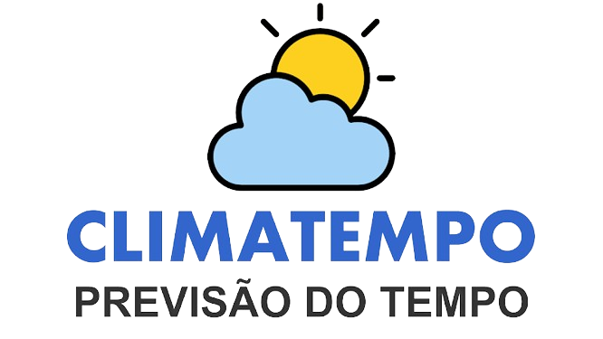
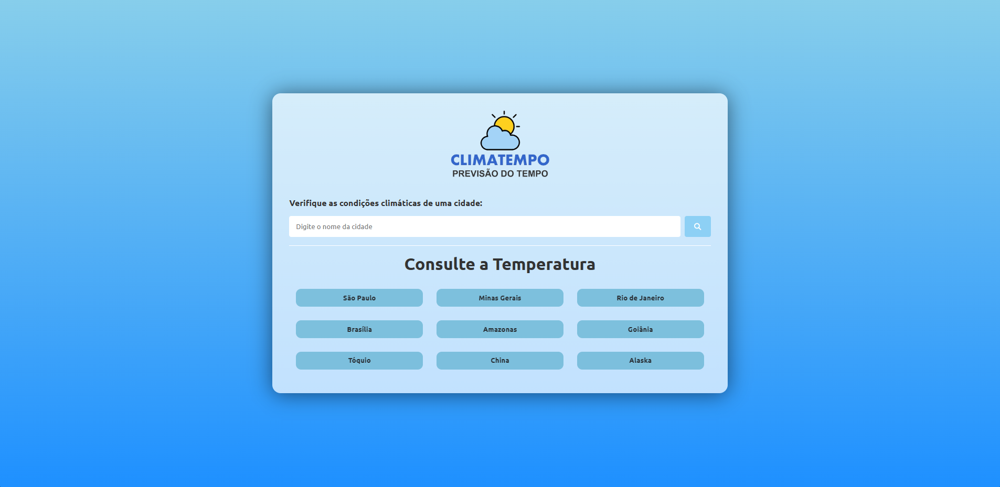
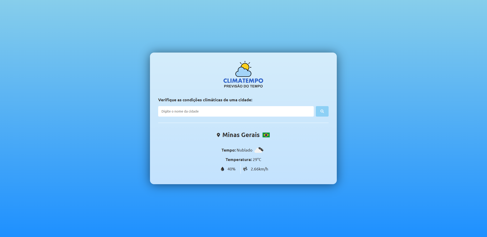

<h1 align="center">Clima Tempo | Veja a previsão do tempo</h1>

  

O **Clima Tempo** é um projeto web desenvolvido para fornecer informações climáticas em tempo real de cidades, estados ou países. Ele foi criado como parte do aprendizado e prática do uso de APIs, sendo o primeiro projeto a incorporar esse conhecimento. A escolha de criar uma aplicação de previsão do tempo foi motivada pela sua relativa simplicidade e pelo amplo acesso à API principal utilizada, a [OpenWeatherMap API](https://openweathermap.org/), que fornece dados como temperatura, vento, umidade e condições climáticas.

## Link do Projeto

Você pode acessar o **Clima Tempo** através do seguinte link: [Clima Tempo - Acesse aqui](https://climatempo0.netlify.app/)

## Tecnologias Utilizadas

O projeto foi desenvolvido por mim, utilizando as seguintes tecnologias:

- HTML
- CSS
- JavaScript

## APIs Utilizadas

O **Clima Tempo** faz uso de duas APIs principais:

1. **OpenWeatherMap API**: Esta API é responsável por fornecer informações climáticas em tempo real, incluindo temperatura, vento, umidade e condições climáticas. Isso permite que você obtenha dados precisos sobre a cidade pesquisada.

2. **FlagsAPI**: Usando a sigla do país fornecida pela OpenWeatherMap API, integrei a FlagsAPI para obter a bandeira correspondente do país. Isso torna a experiência do usuário mais visual e intuitiva, pois exibimos a bandeira do país da pesquisa.

## Funcionalidades

O **Clima Tempo** oferece as seguintes funcionalidades:

- **Pesquisa**: Você pode inserir o nome de uma cidade, estado ou país no campo de pesquisa para obter informações climáticas específicas.
- **Busca Rápida**: Também disponibilizamos uma lista de nove lugares pré-configurados para que você possa obter rapidamente informações climáticas desses locais com apenas um clique.
- **Tratamento de Erros**: Para sua conveniência, incluímos tratamentos de erros. Se você não fornecer um nome de cidade ou inserir um nome de cidade inexistente, verá mensagens de erro informativas para orientá-lo.

## Observações

É importante observar que o **Clima Tempo** atualmente utiliza dados reais da OpenWeatherMap API. No entanto, tenho planos de desenvolver uma "Versão 2" do projeto. Nessa versão, manipularei os dados climáticos da semana para criar informações fictícias. Essas informações falsas serão usadas exclusivamente para melhorar o projeto, uma vez que a obtenção de dados reais requer o pagamento de uma API. Portanto, a versão 1 do projeto fornece dados reais, mas não posso garantir sua precisão devido às limitações da API utilizada.

## Próximos Passos

Estou animado para começar a trabalhar na "Versão 2" do **Clima Tempo**, na qual planejo manipular os dados climáticos para fornecer informações fictícias sobre a previsão do tempo ao longo da semana. Isso proporcionará uma experiência mais rica, mesmo sem o acesso a uma API de dados climáticos em tempo real.

Fique atento para futuras atualizações e melhorias no **Clima Tempo**!

---

### Capturas de Tela

Aqui estão duas capturas de tela do projeto:

1. **Página Inicial com Campo de Pesquisa**:
   

2. **Resultado de uma Pesquisa**:
   

## Contribuições e Sugestões

Estou sempre aberto a contribuições e sugestões para melhorar o **Clima Tempo**. Se você tiver alguma ideia para aprimorar o projeto ou encontrar bugs que gostaria de corrigir, sinta-se à vontade para abrir um "Pull Request" ou criar uma "Issue" em nosso repositório no GitHub.

Agradeço antecipadamente por qualquer contribuição ou sugestão que possa tornar o **Clima Tempo** ainda melhor!

Fique à vontade para entrar em contato comigo através do meu perfil no GitHub: [Ricardo Rodrigues](https://github.com/Ricardo-Rodrigues0)

